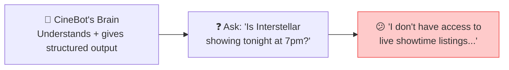
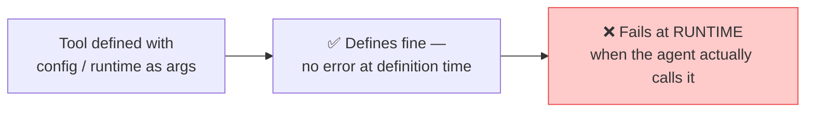
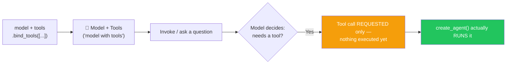
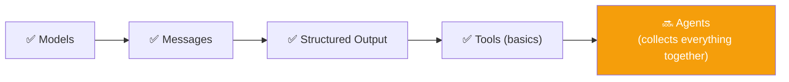
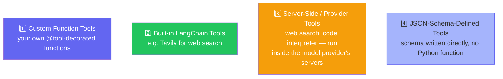
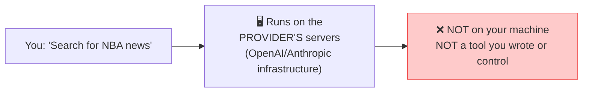
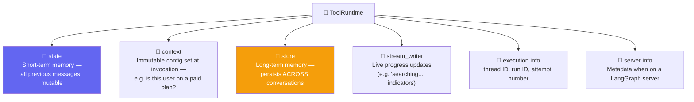
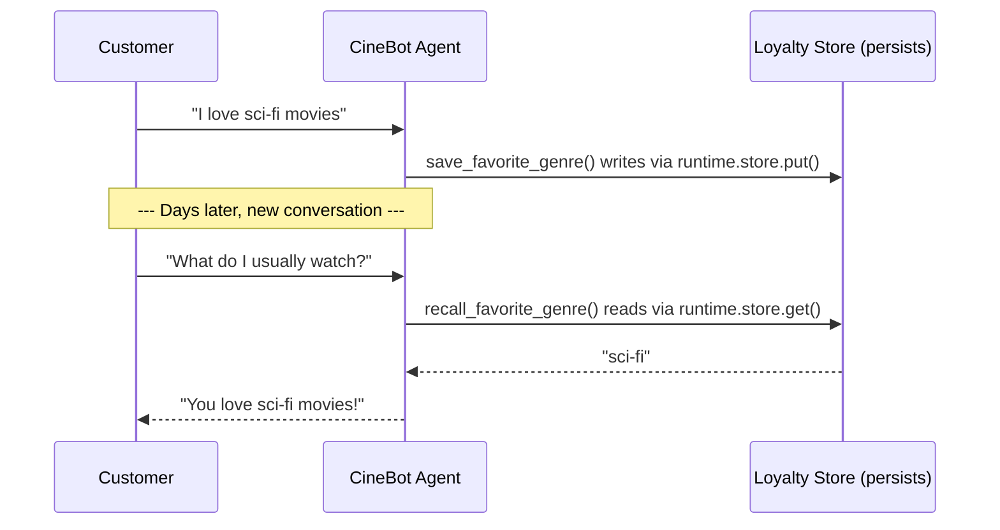

# 🛠️ Class 10: Tools Deep Dive — Giving CineBot Hands
### 📋 Agentic AI 3.0 Specialization | Krish Naik Academy

**🎙️ Mentor:** Mayank Aggarwal
**⏱️ Duration:** ~5+ hours | **📅 Session:** Day 10 (26 July 2026)

---

## 📰 Quick Updates

- 📝 A practical **assignment** tied directly to this class's material was promised for release later the same day.
- 🎯 **Today's announced scope:** Tools and Agents in depth — though as the class unfolded, it became an extended, advanced deep-dive on **Tools** (with Agents formally continuing next class).

---

## ✋ CineBot Has a Brain, But No Hands

> *"Though we created this pretty nice CineBot, and now it's very smart — it can always give the output in a structured manner. But it still doesn't have hands. It still cannot do anything."*



🔬 **Live proof:** asking the structured-output-capable CineBot about a real showtime returned an honest admission that it has no live data access — confirming that even a perfectly structured brain is still just a brain. It can reason and format, but it cannot *act*. That gap is exactly what **tools** exist to close.

---

## 🛠️ Building Your First Tool

```python
from langchain_core.tools import tool

@tool
def check_showtimes(movie_title: str) -> str:
    """Get available showtimes for a given movie."""
    # ...implementation...
    return "Interstellar: 7:00 PM, 9:30 PM"
```

- `@tool` is a **decorator** — it wraps a plain function so it becomes something an agent can call: the function's **name becomes the tool's name**, and its **docstring becomes the tool's description**.
- 🎯 **Core philosophy repeated throughout:** *"Tools are just glorified API calls, or functions. If you don't know how to write a proper function, you will never be able to create a good tool."* Whatever a developer can write as a normal Python function — a DB connection, an external API call — can become a tool, with zero extra magic.
- **Docstrings matter as much as code:** the docstring goes to the AI as the tool's description — it's how the model knows *what* the tool does and *when* to use it.

---

## 🎨 Overriding a Tool's Name & Description

```python
@tool("book_seats", description="Book or reserve a seat. Use whenever a customer wants to book.")
def reserve(movie: str, seats: int) -> str:
    """A short internal docstring."""
    return f"Reserved {seats} seat(s) for {movie}"
```

- By default, the **function name** becomes the tool name and the **docstring** becomes the description — but both can be explicitly overridden.
- 🎯 **Why this matters in practice:** when reusing someone else's existing function (already named something unrelated, like `reserve`), a developer can rename and re-describe it as a tool without touching the underlying implementation.

---

## 🔍 A Built-in Tool in Action — Tavily

```python
from langchain_tavily import TavilySearch

search_tool = TavilySearch()  # a pre-built LangChain tool for web search
```
- Tavily is LangChain's pre-packaged internet search tool — install it, set the API key, and it's ready to bind to any agent, no custom function needed.
- This was flagged as the first hands-on taste of a **built-in tool**, ahead of the full "types of tools" breakdown that comes later in the class.

---

## 📐 Argument Schemas — Why `Field()` Beats Plain Type Hints

```python
from pydantic import BaseModel, Field
from typing import Literal

class SeatBookingInput(BaseModel):
    movie_title: str = Field(description="Exact movie title")
    seat_count: int = Field(gt=0, description="Number of seats")
    preferred_row: Literal["front", "middle", "back"] = Field(default="middle")

@tool(args_schema=SeatBookingInput)
def book_seats(movie_title: str, seat_count: int, preferred_row: str) -> str:
    """Book seats for a movie."""
    return f"Booked {seat_count} seat(s) for {movie_title} in the {preferred_row} row"
```

- 🔬 **Live proof:** printing `book_seats.args` **without** an `args_schema` returned almost nothing useful; **with** a proper Pydantic `args_schema`, it revealed the complete field-level detail — descriptions, constraints, defaults — everything the model needs to fill arguments correctly.
- ⚖️ **The "extra tokens vs. reliability" tradeoff, addressed head-on:** *"Don't think about saving tokens — think about getting the right answer first, in fewer total calls. If you have to hit the model twice because the input schema wasn't clear, saving those 20–30 tokens on the schema was never worth it."*
- 🔑 A tool can be created *without* `@tool` decoration at all — but doing so loses this rich argument metadata, increasing the model's chance of sending malformed input.

---

## 🚫 Reserved Argument Names: `config` and `runtime`

> **Live-triggered on purpose**, starting from a theater-configuration example: Mayank deliberately named tool arguments `config` and `runtime` to show what breaks.



- 🔑 **The rule, explicitly revealed live:** *"These are actually reserved arguments — you cannot use `config` and `runtime`. Using these names will cause a runtime error."* `config` and `runtime` are reserved parameter names in LangChain — never use them as ordinary tool arguments.
- This is exactly why the error appeared to come "out of nowhere" during the live demo — tool *definition* succeeds silently; the failure only shows up when the tool is actually called by an agent.
- ✅ **Confirmed and wrapped up:** *"Config and runtime — they are reserved by LangChain... if you want to use config or runtime, please use some other name."*

---

## 🔗 Binding vs. Execution

> **The setup:** working with a `ChatOpenAI` model (GPT-5-mini), Mayank asked the class directly — *"Once a tool has been bound to a model, do you think the model can ever call it itself?"* The answer, repeated since Day 1 of the course: **no — the AI can never call the tool itself.** Only an agent (or the developer's own code) can actually execute it.

### 🧪 The Deliberate Setup
Earlier in the session, when demonstrating `runtime`, Mayank intentionally left `runtime` **out** of the Pydantic `WeatherInput` schema passed to the tool — specifically so the class could see it fail: *"I have to just show you how we can have runtime. If I use it here, I'm saying to my tool that you'll get `WeatherInput` as the schema, but it's not having runtime. I was just trying to show you how it fails."*

### 💬 Doubts Cleared Along the Way
- **"Can a method take the whole `WeatherInput` object instead of individual fields?"** — Yes, but then the function body has to explicitly pull out each field via dot notation (`weather_input.location`, `weather_input.config`, etc.) rather than receiving them as separate named arguments.
- **"Can `config` be used *anywhere* in the schema, even nested?"** — No. `config` cannot be used anywhere as an argument name, at any level.
- **"Can more descriptive function names replace the need for a docstring?"** — Technically the tool will still work, but a docstring is still strongly recommended regardless of how descriptive the name is.
- **"If `config`/`runtime` are reserved, why does this throw a *runtime* error instead of a *syntax* error at definition time?"** — Because LangChain doesn't know at definition time how the tool will be used. The exact same function might be reused with a completely different framework where `config`/`runtime` aren't reserved at all. Rather than blocking the tool from being defined, LangChain waits until execution — when it actually knows it's operating inside a LangChain agent — to raise the error. A function can even be handed to an agent directly, without the `@tool` decorator at all, and LangChain will still accept it; it simply can't warn about a `config`/`runtime` clash until the tool is actually run.

### 🔬 The Live Demo: Binding Two Tools
```python
tools = [check_showtimes, book_seats]
model_with_tools = model.bind_tools(tools)

response = model_with_tools.invoke("Is Interstellar showing tonight, can you book two seats?")
```

- The response came back with **`content` completely empty** — and the actual instruction living inside `response.tool_calls`: the tool's `name` (`book_seats`), its `args` (`movie_title: "Interstellar"`, `seats: 2`, `preferred_row: "middle"`), plus a `config` value the model tried to pass automatically — a live, concrete reminder of exactly why `config` is off-limits as an argument name.
- 🔑 **The point of the whole demo:** *"Will this ever be able to call the tool and make something happen for you? No. You want a complete harness around it — which is provided by an agent."*



> This exact diagram was drawn live and saved directly into the shared class notes as a permanent reference.

### 🔁 Re-explained After the Break, for Anyone Still Unsure
Enough learners asked to hear this again that Mayank repeated the whole demo from scratch after the break, using a fresh example: *"Is Interstellar showing tonight, can you book two seats?"*

```python
for tool_call in response.tool_calls:
    print(tool_call["name"])
    print(tool_call["args"])
```

- 🎯 **The misconception being corrected directly:** *"Many people think that once you bind a tool to a model, the tool gets called. From the very first class, I've been telling you — AI can never call the tool. An agent, or you, will call the tool. It will never happen any other way."*
- Printing `response.tool_calls` after the re-run showed exactly the same shape as before: a tool name (e.g. `check_showtimes`) and its arguments, extracted from an otherwise empty `AIMessage` — reinforcing that **"model with tools" is a fundamentally different, more limited thing than "agent."** A model with tools can only ever *request* a tool call; only `create_agent()` closes the loop and actually executes it.

---

## 🧭 Mid-Class Recap — "Is This Tools Done?"

> *"Let me help you revise. We started with tools, and we understood that we can create a tool which we can bind to our model, or add to our agents... tools are just methods with a properly defined input, output, and description."*



> *"This was a very basic thing... 0 to 0.2 of the tool. Let me now take you a lot more ahead once we come back."* A short break followed this recap, before moving into advanced tool internals.

---

## 📚 Four Types of Tools — The Full Breakdown



### 🌐 Server-Side Tools — A Crucial Distinction
> **The question posed:** when Claude or ChatGPT does a live web search inside its own chat interface, does that search run on *your* machine?


- 🔬 **Live demo:** confirmed directly that a ChatGPT/Claude web search runs entirely on the provider's own servers — it's a capability baked into the model's serving infrastructure, not a tool the developer defines, controls, or can inspect. **This is fundamentally different** from a custom `@tool`-decorated function that a developer writes and runs themselves.

### 📄 JSON-Schema-Defined Tools
- Tools can also be defined by writing a plain **JSON schema** directly, without wrapping a Python function at all — a standardized, provider-agnostic format.
- 🎯 Mayank's recommendation: *"You can define the schema like this, but I will suggest that you use Pydantic — it's much better."* The JSON-schema route is good to recognize, but Pydantic remains the preferred day-to-day approach for this course.

---

## 🪞 Tool Runtime — The Mirror Analogy

> **The core distinction:** *"A model can only see its own tool-declared arguments — that's its own reflection, like looking in a mirror. But a tool can accept a special argument called `runtime`, which lets it see a whole world behind the mirror that the model itself never sees."*

```python
from langchain.tools import ToolRuntime

@tool
def get_weather(location: str, runtime: ToolRuntime) -> str:
    """Get weather for a location."""
    # `location` — visible to the model, part of what it decides to send
    # `runtime`  — invisible to the model, full of backend-only context
    ...
```

🔬 **Live proof:** printing a tool's `.args` after adding a `runtime: ToolRuntime` parameter showed the model still only sees `location` — `runtime` never appears in what the model is aware of, confirming it's purely a backend mechanism.

### 🧭 What Lives Inside `runtime`



- 🎯 **Why this matters, concretely:** *"ChatGPT and Claude's tools run 'better' — longer, more thoroughly — for paid-plan users. That's exactly this kind of `context` information being read inside a tool at runtime."*
- 📌 **Short-term vs. long-term memory, crisply defined:** `state` = current conversation only; `store` = survives across entirely separate conversations (saved preferences, knowledge bases). Full memory architecture (PostgreSQL-backed persistence, etc.) is reserved for a dedicated future class — this session only needed the concept in service of tools.
- 💬 *"This is a little advanced — you may not see this depth in any YouTube tutorial. But you should know this."*

---

## 🎬 Live Demo: A Tool That Remembers Customer Preferences

```python
from langgraph.store.memory import InMemoryStore
from langchain.tools import ToolRuntime, tool

loyalty_store = InMemoryStore()  # like a dictionary that survives across conversations

@tool
def save_favorite_genre(customer_id: str, genre: str, runtime: ToolRuntime) -> str:
    """Save a customer's favorite movie genre for future visits."""
    runtime.store.put(customer_id, "preferences", {"favorite_genre": genre})
    return f"Got it! I'll remember you like {genre} movies."

@tool
def recall_favorite_genre(customer_id: str, runtime: ToolRuntime) -> str:
    """Recall a customer's favorite genre if previously saved."""
    result = runtime.store.get(customer_id, "preferences")
    if result:
        return f"Your favorite genre is {result.value['favorite_genre']}"
    return "We don't have any saved preference for this customer."

agent = create_agent(
    model=model,
    tools=[save_favorite_genre, recall_favorite_genre],
    store=loyalty_store,   # attaches the store so tools can access it via runtime
)
```



- `InMemoryStore()` is a simple, RAM-based checkpoint store — described plainly as *"just a dictionary, maintaining messages and memory."* Production systems would swap this for a persistent backend (e.g. PostgreSQL), covered in a dedicated future memory module.
- 🔬 **Debugging in real time:** several library/version mismatches surfaced live (`InMemorySaver` had moved to a new import path, missing arguments, etc.) — Mayank used these as teaching moments: *"If you don't face errors, you don't grow,"* and walked through checking updated documentation and restarting the kernel rather than just pasting a fix.
- 🎯 **The key realization:** tools are no longer just stateless functions — with `runtime.store`, a tool can **read and write persistent data**, giving an agent genuine memory across sessions, not just within a single conversation's message history.

---

## 💬 Live Q&A Highlights

| Question | Answer |
|---|---|
| Is a tool genuinely *just* a function call? | Yes — genuinely, nothing more |
| Does passing an `args_schema` cost more tokens? | Slightly, yes — but reliability matters more than saving 20–30 tokens if it avoids a failed/retried call |
| Can `config`/`runtime` ever be used as tool argument names? | No — reserved by LangChain; will fail at runtime even though the tool defines without error |
| Is `ToolStrategy` related to tool definitions? | No — `ToolStrategy` is purely for **structured output** (from the previous class), unrelated to defining tools themselves |
| Do frameworks other than LangChain (CrewAI, LangGraph, etc.) matter as much as the concepts? | No — *"Framework is not important. Concept is important."* Once fundamentals are solid, switching frameworks is fast |
| For an experienced non-CS professional (e.g. 9 years in a no-code platform like ServiceNow) — is deep DSA knowledge required to get hired? | Not heavily, except at large product-based companies (Amazon, Google-tier), which may still test DSA in early rounds regardless of experience; for most roles, strong applied AI-integration projects matter more |

---

## ✅ Action Items After Class 10

- [ ] 🛠️ Write a `@tool`-decorated function from scratch with a clear docstring, and confirm the model can see and use its description
- [ ] 🎨 Practice overriding a tool's name and description explicitly rather than relying on defaults
- [ ] 📐 Build a Pydantic `args_schema` for a tool with `Field()` constraints, and compare `.args` output with and without it
- [ ] 🚫 Deliberately name a tool argument `config` or `runtime` and observe the runtime failure firsthand
- [ ] 🪞 Add a `runtime: ToolRuntime` parameter to a tool and print `.args` to confirm the model never sees it
- [ ] 🎬 Recreate the `save_favorite_genre` / `recall_favorite_genre` demo using `InMemoryStore` and `runtime.store`
- [ ] 📖 Revise all four tool types (custom function, built-in LangChain, server-side/provider, JSON-schema) before next class
- [ ] 📅 Come back ready for **Agents in depth** — the module that ties Models, Messages, Structured Output, and Tools together

---

*📝 Notes compiled from the full Class 10 transcript — "Tools Deep Dive: Giving CineBot Hands," Agentic AI 3.0 Specialization, Krish Naik Academy.*
