# 🔌 Class 24: LangChain + MCP in Practice — Adapters, Tool Output, Auth & Multi-Server Agents
### 📋 Agentic AI 3.0 Specialization | Krish Naik Academy

**🎙️ Mentor:** Mayank Aggarwal
**⏱️ Duration:** ~4 hours | **📅 Session:** Day 24 (3 October 2026)

---

## 📰 Quick Updates

- 📥 **Pull the latest code first.** Everything for this class was already pushed to the shared **Live Class 2026** repo under the *Weekend 14 – Oct 3 & Oct 4* folder. Mayank asked everyone to `git pull` (or download the zip) before starting, and kept pushing updates during the session.
- 🎯 **Today's scope:** the *practical* side of MCP inside LangChain, done in VS Code. Last class covered the theory (what the LangChain MCP adapter is, and why multi-agent exists); this class wires it up for real, then previews the multi-agent patterns that tomorrow's class opens with.
- 🗺️ **What's coming:** tomorrow starts with about an hour of multi-agent in LangChain, then a walkthrough of setting up a **GCP account** and the first **GCP project**. A second GCP project follows, with the two projects planned to finish within two classes. **LangGraph** starts only after those. The project code has been shared up front, with a firm request to read it *before* class, because the project is deep and he won't be writing it line by line.
- 🐍 A **12-hour Python course** (no AI used, taught through the Python Tutor visualizer) was going live on Mayank's YouTube that night, and an **async/await** video was planned for that week, since async syntax appears throughout today's code.
- 🎁 Two Udemy course coupons (the second for a Claude course, with Claude Code content still being recorded) were shared, limited to roughly the first 100 users. The ask in return was to actually learn from them and leave a rating and feedback.
- 💼 A direct hiring lead for senior roles (Technical Architect, Technical Lead, Senior Product Manager, Product Manager; roughly 6–14 years of experience) was shared through the class Craft doc, with the application details given there.

---

## 🖥️ Why This Class Moved From Colab to VS Code

The earlier MCP and LangChain work happened in Colab. This class doesn't, for two reasons:

- **STDIO isn't properly supported in Colab.** A local MCP server needs to run as a subprocess on *your* machine, and Colab runs on a machine that isn't yours.
- **Sync and async code mixed together** tends to throw errors in Colab, and the adapter code here is async-heavy.

Setup was short: `uv sync`, a `.env` file with an OpenAI API key (a paid key; there's no free model option for this), a new notebook selecting the project's kernel, and a quick `assert` that the key loads.

### A Brand-New Package (and a Beta Warning)

One change worth knowing: LangChain moved away from the separate **`langchain-mcp-adapters`** package and built MCP support into LangChain itself as **`langchain.mcp`**. It's installed through an extra, and the project's `pyproject.toml` pins it that way:

```toml
dependencies = [
    "langchain[mcp]>=1.4.0",
    "langchain-openai>=0.3.0",
    "fastmcp>=2.0.0",
    "python-dotenv>=1.0.0",
    # ipykernel, jupyter ...
]
```

The concepts haven't changed, but the module is new enough that merely importing it raises a beta warning: *"`langchain.mcp` is in beta. It is actively being worked on, so the API may change."* The notebooks silence it once and carry on:

```python
import warnings
from langchain.mcp import LangChainBetaWarning
warnings.filterwarnings("ignore", category=LangChainBetaWarning)
```

The documentation, Mayank reminded the class, is the source of truth for anything this fresh. It's also what ChatGPT and Claude are ultimately writing code from.

---

## 🌉 Connecting a LangChain Agent to a Local MCP Server

The server is CineBot's own **FastMCP server**, built in earlier classes, now exposing three tools: `check_showtimes`, `cancel_booking`, and `get_seat_map`. The adapter starts the server itself as a subprocess over STDIO, so nothing has to be launched separately.

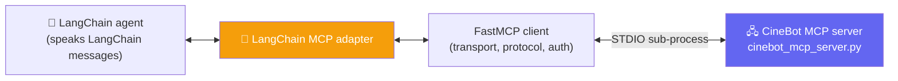

### The Server

This is the server as it stands in the class notebook. The first demos ran these same three tools over STDIO; the token check and HTTP mode were added later, for the authentication demo. (The standalone `cinebot_mcp_server.py` committed in the repo folder is an earlier, single-tool version.)

```python
from fastmcp import FastMCP
from fastmcp.server.auth import AccessToken, TokenVerifier
from mcp.types import ToolAnnotations

AUTH_TOKEN = "cinebot-secret-token"

class StaticTokenVerifier(TokenVerifier):
    """Accepts requests whose bearer token exactly matches AUTH_TOKEN."""
    async def verify_token(self, token: str) -> AccessToken | None:
        if token == AUTH_TOKEN:
            return AccessToken(token=token, client_id="cinebot-client", scopes=[])
        return None

mcp = FastMCP("CineBot", auth=StaticTokenVerifier())

@mcp.tool()
def check_showtimes(movie_title: str) -> str:
    """Check available showtimes for a movie."""
    fake_showtimes = {"interstellar": "7:00 PM and 10:15 PM", "dune part two": "9:30 PM"}
    return fake_showtimes.get(movie_title.lower(), "No showtimes found.")

@mcp.tool(annotations=ToolAnnotations(destructiveHint=True, requiredAuthentication=True))
def cancel_booking(booking_id: str) -> str:
    """Cancel an existing booking. Irreversible."""
    return f"Booking {booking_id} cancelled."

@mcp.tool()
def get_seat_map(movie_title: str) -> dict:
    """Get the seat map for a movie -- returns structured data, not just text."""
    return {"movie": movie_title, "available_rows": ["A", "B", "C"], "sold_out_rows": ["D"]}

if __name__ == "__main__":
    mcp.run(transport="http", port=8000)
```

### Connecting and Listing Tools

```python
from pathlib import Path
from langchain.mcp import MCPAdapter
from fastmcp.client.transports import PythonStdioTransport

cinebot_mcp_transport = PythonStdioTransport(
    script_path=Path("cinebot_mcp_server.py"),      # the real server file
    log_file=Path("cinebot_mcp_server.log"),         # the server's startup is logged here
)

async with MCPAdapter(cinebot_mcp_transport) as mcp_adapter:
    tools = await mcp_adapter.list_tools()
    print("Available tools:", [t.name for t in tools])
# Available tools: ['check_showtimes', 'cancel_booking', 'get_seat_map']
```

### A Live Bug Worth Remembering

The first attempt failed with *"Connection closed."* The cause was that the server file had been created by a notebook cell that also *ran* it, so there was no standalone file for the transport to launch. Once the transport pointed at the actual server file, everything connected. The takeaway: with STDIO, the adapter needs a real script path it can start as a subprocess. A notebook cell isn't one.

### Calling a Tool Directly, Then Through an Agent

Before involving an agent at all, the tool was called on its own, then the same tools were handed to an agent:

```python
async with MCPAdapter(cinebot_transport) as adapter:
    tools = await adapter.list_tools()
    showtime_tool = next((t for t in tools if t.name == "check_showtimes"), None)

    direct_result = await showtime_tool.ainvoke({"movie_title": "interstellar"})
    print("Direct invocation result:", direct_result)

    try:
        cinebot_agent = create_agent(model="openai:gpt-5-mini", tools=tools)
        result = await cinebot_agent.ainvoke(
            {"messages": [("user", "What are the showtimes for Interstellar?")]}
        )
    except Exception as e:
        print("Error during agent invocation:", e)
```

The direct call printed a list of content blocks, not a bare string: `[{'type': 'text', 'text': '7:00 PM and 10:15 PM', 'id': 'lc_…'}]`. The agent run made the cost difference visible in its message metadata:

| Step | What happened | Tokens |
|---|---|---|
| Direct tool call | The client called the server straight away | **0** (no model involved) |
| Agent, model call 1 | Decided to call `check_showtimes` | 194 in + 26 out = **220** |
| Agent, model call 2 | Read the tool result and wrote the reply | 236 in + 170 out = **406** |

So the agent path spent **626 tokens** across two model calls, while the server itself used none. The friendly reply (*"Interstellar is showing at 7:00 PM and 10:15 PM. Would you like to book tickets or see the seat map…?"*) came from the model, not the server. MCP returned only the times. `ainvoke` instead of `invoke` is the only difference between the sync and async versions of the same thing, and the agent's tool calls happen internally, so an end user never sees the routing.

---

## 🔄 What the Adapter Actually Translates

A recurring emphasis: the adapter isn't magic, and understanding its job is what separates "I know how to connect MCP" from "I could build an adapter for another framework."

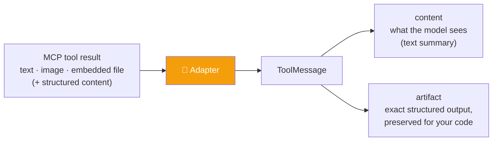

### Multimodal Content Blocks

An MCP tool result isn't limited to text. `langchain.mcp` converts whatever the server sends into standard LangChain **content blocks**, so a model sees one uniform shape regardless of what kind of server produced it:

| MCP content type | Converts to |
|---|---|
| `TextContent` | text content block |
| `ImageContent` | image content block (base64 + mime type) |
| `ResourceLink` (image mime type) | image content block (by URL) |
| `ResourceLink` (other) | file content block |
| `EmbeddedResource` (text) | text content block |
| `EmbeddedResource` (blob) | image or file content block, by mime type |
| `AudioContent` | **not yet supported** — raises `NotImplementedError` |

### Why the Translation Matters

- **ToolMessage.** The agent only understands LangChain's own message types; hand it a raw string and it can't make sense of it. Mayank's analogy: explaining the same concept in French to someone who doesn't speak it. This is why the LangChain MCP adapter, not just any MCP client, is used with a LangChain agent. Every other framework (CrewAI, AutoGen) has its own adapter that must do the same translation.
- **Using the MCP client directly** (no adapter) works, but then *you* are responsible for converting the results into tool messages.

### Content vs. Artifact: Why It Matters for Cost

`get_seat_map` returns **structured** data, not a string. Calling the tool by hand, with a tool-call dictionary, showed both views:

```python
async with MCPAdapter(cinebot_mcp_transport) as mcp_adapter:
    tools = await mcp_adapter.list_tools()
    seat_map_tool = next(t for t in tools if t.name == "get_seat_map")

    tool_call = {
        "name": "get_seat_map",
        "args": {"movie_title": "Interstellar"},
        "id": "unique_call_id_12345",
        "type": "tool_call",
    }
    message = await seat_map_tool.ainvoke(tool_call)
    print("Text Content (what my model reads)", message.content)
    print("Structured Data (what my code can use)", message.artifact)
    print(message.artifact["structured_content"]["available_rows"])
```

What it printed:

```
Text Content (what my model reads)
  [{'type': 'text', 'text': '{"movie":"Interstellar","available_rows":["A","B","C"],"sold_out_rows":["D"]}', 'id': 'lc_…'}]
Structured Data (what my code can use)
  {'structured_content': {'movie': 'Interstellar', 'available_rows': ['A', 'B', 'C'], 'sold_out_rows': ['D']}}
['A', 'B', 'C']
```

The model sees a JSON *string* inside a text block, while the artifact holds the real dictionary under a `structured_content` key. A tool-call dictionary like this is what happens inside an agent anyway: a name, arguments, a generated ID, and a type. The practical payoff is that the model often needs only a text view of a very large structured result. A middleware can send the model just the useful part (for example, only the available rows) while the full structure stays in the artifact for your code to use. That's a step-by-step token-saving improvement of the kind a company actually cares about, and it isn't something an AI coding assistant will add unprompted: it can write the code, but you have to know to ask for it.

---

## ⚠️ Error Handling: Two Different Kinds of Failure

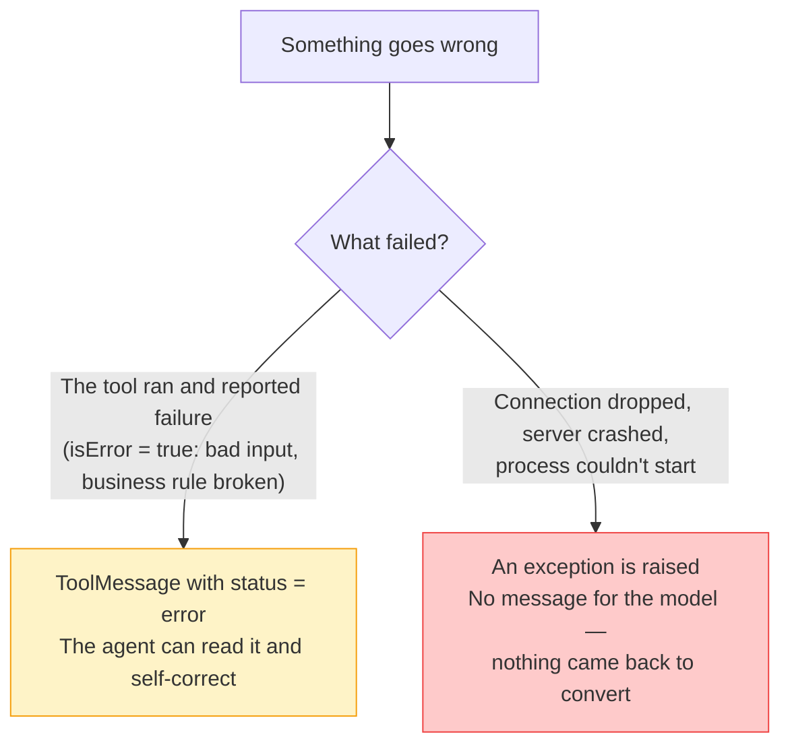

A small error server demonstrated the first kind: a `risky_lookup` tool that rejects any booking ID not starting with `BK`.

```python
from fastmcp import FastMCP
mcp = FastMCP("CineBot")

@mcp.tool()
def risky_lookup(booking_id: str) -> str:
    """Look up a booking -- fails if the ID format is wrong."""
    if not booking_id.startswith("BK"):
        raise ValueError(f"Invalid booking ID format: {booking_id!r}. Expected it to start with 'BK'.")
    return f"Booking {booking_id}: confirmed."

if __name__ == "__main__":
    mcp.run()
```

Calling it with `12345` through the adapter:

```python
error_transport = PythonStdioTransport(
    script_path=Path("cinebot_error_server.py"),
    log_file=Path("cinebot_error_server.log"),
)
async with MCPAdapter(error_transport) as mcp_adapter:
    tools = await mcp_adapter.list_tools()
    bad_call = {"name": "risky_lookup", "args": {"booking_id": "12345"},
                "id": "bad_call_001", "type": "tool_call"}
    error_message = await tools[0].ainvoke(bad_call)
```

```
content=[{'type': 'text', 'text': "Error calling tool 'risky_lookup': Invalid booking ID format: '12345'. Expected it to start with 'BK'.", …}]
name='risky_lookup'  tool_call_id='bad_call_001'  status='error'
```

It came back as a **`ToolMessage` with `status='error'`**, not an exception. The adapter had converted the server's `ValueError` into something the agent could understand and react to. Mayank asked the class a pointed question to drive it home: did the *MCP server* return a tool message? No — LangChain's adapter did the conversion. The log file confirmed what was happening underneath: the server really was being started as a STDIO subprocess, exactly as taught in the transport classes. The two failure types need separate handling, because the second kind can only be caught as an exception. (The notebook's own summary: "isError=True → status='error' automatically; transport errors raise either way.")

---

## 🏷️ Tool Metadata: Letting the Server Hint, the Client Decide

An MCP server can attach **annotations** to a tool: extra information about it. CineBot's `cancel_booking` carries a **destructive hint**. LangChain surfaces this under a single `mcp` namespace in each tool's metadata, so client code can read it and apply *any* logic it likes, instead of hard-coding tool names.

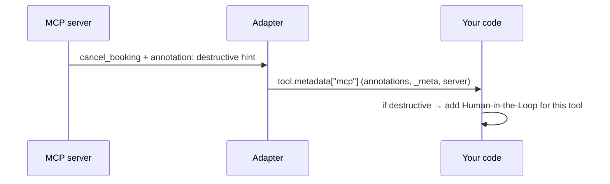

Printing the tools showed exactly what the adapter hands over. For `cancel_booking`:

```
metadata={'mcp': {'tool': {'annotations': {'destructive_hint': True},
                           '_meta': {'fastmcp': {'tags': []}}},
                  'server': {'name': 'CineBot', 'version': '4.0.10'}}}
```

while `check_showtimes` and `get_seat_map` carry no `annotations` entry at all. The helper reads that nested key, and one `HumanInTheLoopMiddleware` config is built from whatever the server marked destructive:

```python
from langchain.agents.middleware import HumanInTheLoopMiddleware

def is_destructive_tool_call(tool):
    meta = (tool.metadata or {}).get('mcp', {}).get('tool', {}).get('annotations', {})
    return bool(meta.get('destructive_hint'))

async with MCPAdapter(cinebot_transport) as adapter:
    tools = await adapter.list_tools()
    for t in tools:
        print(f"{t.name}: destructive={is_destructive_tool_call(t)}")

    # One HITL config, built dynamically from whatever the server marked destructive.
    interrupt_on = {
        t.name: {"allowed_decisions": ["approve", "edit", "reject"]}
        for t in tools if is_destructive_tool_call(t)
    }
    hitl_middleware = HumanInTheLoopMiddleware(interrupt_on=interrupt_on)
    cinebot_guarded = create_agent(model="openai:gpt-5-mini", tools=tools, middleware=[hitl_middleware])
```

```
check_showtimes: destructive=False
cancel_booking: destructive=True
get_seat_map: destructive=False

interrupt_on config: {'cancel_booking': {'allowed_decisions': ['approve', 'edit', 'reject']}}
```

(As with any human-in-the-loop setup, the agent also needs a checkpointer to pause and resume.) The exact key name tripped up the demo live: the metadata uses `destructive_hint`, in snake case, while the server declares `destructiveHint=True`. The fix was found with help from the class. The lesson: print a tool's metadata and read what your server actually sends. Human-in-the-loop is only one example; the same hint can drive any logic. One more detail from the printed output: the server also declared a `requiredAuthentication=True` annotation on `cancel_booking`, but only `destructive_hint` appeared in the annotations that came through. Custom annotation fields shouldn't be assumed to survive the trip, so check before relying on one.

Two clarifications from the room: tools from *third-party* servers expose the same information — print the tools and read what they send. And this is **not elicitation**. Elicitation is a *server* asking a question mid-call; here it's the client acting on metadata the server provided.

### Elicitation Meets the Modern Protocol

The notebook describes the intended design: when a server needs to ask something mid-call, the adapter answers automatically with a LangGraph `interrupt()`, a human responds outside the graph, and the call is retried with the answer.

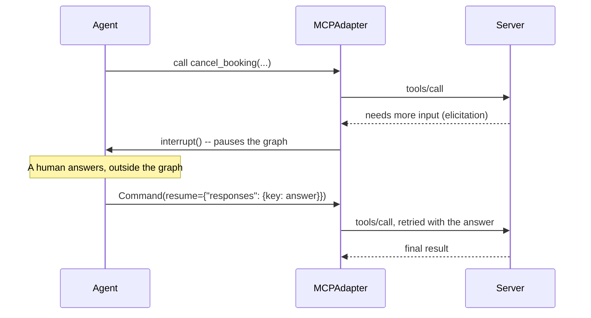

The server side is short:

```python
from fastmcp import FastMCP, Context

mcp = FastMCP("CineBotElicit")

@mcp.tool()
async def cancel_booking_confirm(booking_id: str, ctx: Context) -> str:
    """Cancel a booking, but ask the caller to confirm first."""
    result = await ctx.elicit(
        f"Confirm cancellation of booking {booking_id}?",
        response_type=bool,
    )
    if result.action != "accept":
        return f"Cancellation of {booking_id} aborted ({result.action})."
    if not result.data:
        return f"Cancellation of {booking_id} aborted (user said no)."
    return f"Booking {booking_id}: cancelled."
```

Run live against this server, the call came back with `status: error` and the message *"elicitation via server-initiated requests is unavailable on 2026-07-28 connections."* That is the modern protocol era at work: as covered last class, server-initiated elicitation is a legacy-era mechanism, so on a modern connection there is nothing to carry it. Mayank's take was that this is fine to move past, since LangChain and the wider ecosystem are heading the same way. The server-side logic is still worth understanding, and trying it in legacy mode was left as an exercise.

---

## 🧭 Connecting to More Than One Server

Real deployments rarely talk to a single server. There are two patterns, with a real trade-off between them:

| Pattern | What it does | Tool naming | Protocol negotiation |
|---|---|---|---|
| **`MCPConfig` dict** | One aggregate connection across several servers | Prefixed by the config key you choose | **Shared** — the whole fleet negotiates down to the oldest protocol era any member requires |
| **`ClientGroup`** | Independent connections, one per server | Namespaced `{server}_{tool}` automatically | **Independent** — each member keeps its own protocol era and auth |

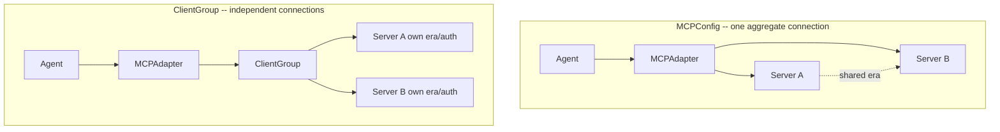

### The Config Dictionary

It's the same `mcpServers` format already seen when configuring Claude:

```python
from fastmcp.mcp_config import MCPConfig

fleet_config: MCPConfig = {
    "mcpServers": {
        "cinebot": {"command": "python", "args": ["cinebot_mcp_server.py"]},
        "errors":  {"command": "python", "args": ["cinebot_error_server.py"]},
    }
}

async with MCPAdapter(fleet_config) as adapter:
    fleet_tools = await adapter.list_tools()
    print("MCPConfig fleet tools:", [t.name for t in fleet_tools])
# ['cinebot_check_showtimes', 'cinebot_cancel_booking', 'cinebot_get_seat_map', 'errors_risky_lookup']
```

Every tool name picked up its config key as a prefix. The run also printed an info message from FastMCP's proxy: it detected a connected client and *reused the existing session for all requests*, warning that this can mix context in concurrent scenarios and suggesting a disconnected client to avoid it. That's worth knowing before putting a config-based fleet under heavy load.

### The Client Group

```python
from fastmcp.client import Client
from fastmcp.client.group import ClientGroup

group = ClientGroup(
    {
        "cinebot": Client(Path("cinebot_mcp_server.py")),
        "errors": Client(Path("cinebot_error_server.py"), mode="legacy"),
        "time_track_server": Client("https://time-track-mcp-server.vercel.app/mcp/"),
    }
)
async with MCPAdapter(group) as adapter:
    group_tools = await adapter.list_tools()
    print("ClientGroup fleet tools:", [t.name for t in group_tools])
```

```
['cinebot_check_showtimes', 'cinebot_cancel_booking', 'cinebot_get_seat_map', 'errors_risky_lookup',
 'time_track_server_log_time', 'time_track_server_get_timesheet',
 'time_track_server_get_project_summary', 'time_track_server_list_projects']
```

One group reached a local STDIO script, a legacy-mode server, and a remote HTTP server by URL, with each tool namespaced by the server it came from. Connecting through a group also gives control over *mode* (a plain adapter connection doesn't), and the default `auto` mode negotiates the newest version a server understands. Legacy mode is also what the elicitation demo would need.

### Which One to Use

Mayank's advice was deliberately simple: **start with the config dictionary.** Check the protocol; if an error or warning appears — which is likelier now that legacy and modern servers coexist (the legacy-only era ended only recently) — move to a client group. A client group is also the answer when two servers need *different authentication*. Legacy mode can be used with the config dictionary; the friction shows up when a modern and a legacy server are mixed.

---

## 🔐 Authentication: Bearer, OAuth, and the User-Level Question

Auth is configured on the **FastMCP client**, not on `MCPAdapter` itself. The adapter just wraps whatever client you hand it, or builds a default one for a bare URL.

| Need | Pattern |
|---|---|
| Bearer token | `Client(url, auth=token)` |
| OAuth 2.1 (discovery, browser redirect, token exchange) | `Client(url, auth="oauth")` |
| Persisted OAuth across runs | `Client(url, auth=OAuth(mcp_url=url, token_storage=...))` |
| Different auth per server | `ClientGroup` with a different `auth=` on each member `Client` |
| Per-user auth in a deployment | A custom auth handler resolves the caller server-side; the graph factory mints or exchanges a token per user (a LangGraph topic, deferred) |

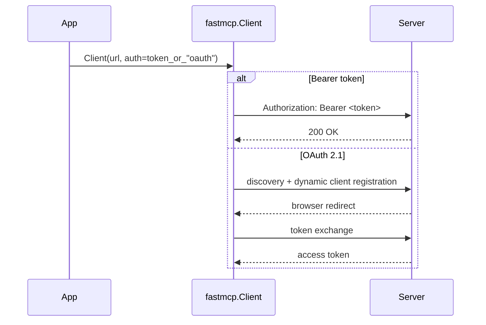

The bearer-token demo was set up live by asking Claude Code to add a simple static token check to the CineBot server. That's the `StaticTokenVerifier` shown in the server code earlier, which accepts a request only if its bearer token exactly matches a secret. The client side is a single line:

```python
async def load_tools_with_bearer(url: str, token: str):
    # `auth` accepts a bearer-token string, the literal "oauth", or any httpx.Auth.
    async with MCPAdapter(Client(url, auth=token)) as adapter:
        return await adapter.list_tools()

# Must match AUTH_TOKEN in cinebot_mcp_server.py. The server now serves over HTTP
# (port 8000), because a bearer check only applies at a network boundary:
#   python cinebot_mcp_server.py
cinebot_tools = await load_tools_with_bearer("http://127.0.0.1:8000/mcp", "cinebot-secret-token")
```

A side lesson from the live edit: Claude Code tried to be "over-smart" by reading files it didn't need to touch, so its changes need review, and its output should be understood, not just accepted.

### Company-Level vs. User-Level Authorization

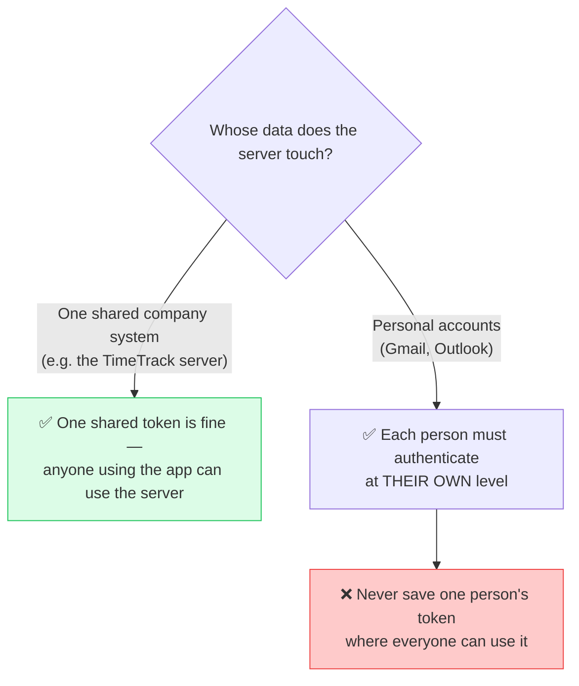

The Facebook analogy: one family member logging in shouldn't unlock everyone else's account. If a chatbot is handed to many people, a Gmail connector must ask each user to authenticate individually. Servers also *tell you* what they require: an OAuth server demands a browser redirect, a key-based server asks for the key — you don't have to guess. Tokens expire according to whoever issues them, nothing to do with MCP; once one expires, the connection simply errors again.

---

## 📊 What the New LangChain MCP Package Does *Not* Do (Yet)

A comparison table in the class notebook made the limitations explicit. The new built-in `langchain.mcp` is not a strict superset of the older `langchain-mcp-adapters`:

| | `langchain-mcp-adapters` (older, separate) | `langchain.mcp` (new, beta, built in) |
|---|---|---|
| Install | `pip install langchain-mcp-adapters` | `pip install "langchain[mcp]>=1.4.0"`, no separate package |
| Entry point | `MultiServerMCPClient({...}).get_tools()` | `async with MCPAdapter(target) as adapter: await adapter.list_tools()` |
| Resources | ✅ Supported | ❌ **Not exposed**: drop to the underlying `fastmcp.Client` |
| Prompts | ✅ Supported | ❌ **Not exposed**: same workaround |
| Tool-call interceptors (logging, retry, `Command` updates) | ✅ Supported | ❌ **No interceptor hook in this beta**: wrap tools yourself after `list_tools()` |
| Progress callbacks | ✅ Supported | Not part of the public `MCPAdapter` surface reviewed |
| Structured content | Via `ToolMessage` content | `ToolMessage.artifact["structured_content"]` |
| Error handling | `handle_tool_errors` flag | `isError=True` → `status="error"` automatically; transport errors raise either way |
| Tool metadata | Ungrouped | Single `tool.metadata["mcp"]` namespace |
| Elicitation | Not built in | Automatic, via LangGraph `interrupt()` |
| Status | Mature, stable | **Beta**: "actively being worked on, so the API may change" |

The notebook's own takeaway is balanced: if you need resources, prompts, or interceptor-style middleware around MCP calls *today*, the older package still does things the new one doesn't. If you're starting fresh and only need tools, the new built-in path is where LangChain is clearly headed. It isn't "old bad, new good". It's different surface area, and the new one isn't a full superset yet.

Mayank's caution about all of this: it's true "as of now." The package is in beta, and a point release could bring resources and prompts back, so check the docs rather than assuming. Since resources and prompts aren't exposed, fetch them through the underlying FastMCP client, the same way it was done in an earlier class. Elicitation is handled through LangGraph interrupts, to be covered with LangGraph.

---

## 🧪 A Mini Project: One Agent, Three MCP Servers

A short companion notebook put three kinds of server behind one agent and one question box:

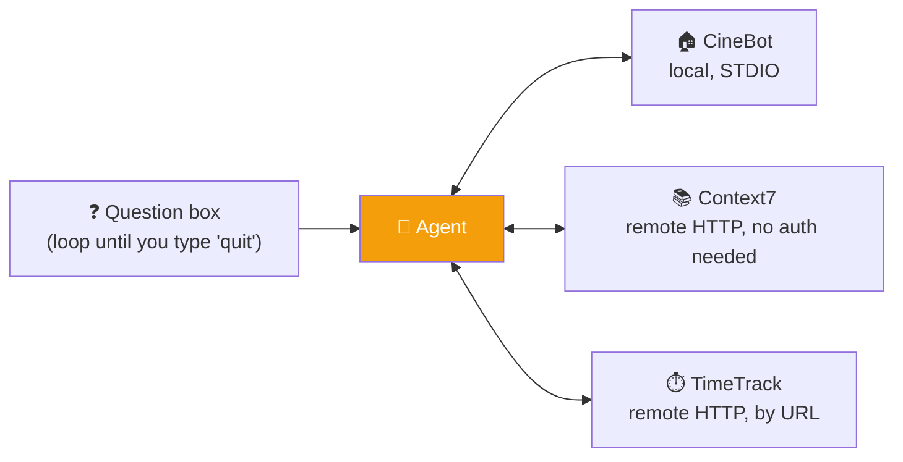

Each server connects in its **own `try`/`except`**, and whatever succeeds gets merged into one tool list. The reason is practical: for a live audience, one server being down or network-blocked doesn't take out the whole demo.

```python
all_tools = []
server_status = {}

# 1. Local CineBot (STDIO)
try:
    cinebot_transport = PythonStdioTransport(
        script_path=Path("cinebot_mcp_server.py"),
        log_file=Path("cinebot_mcp_server.log"),
    )
    async with MCPAdapter(cinebot_transport) as adapter:
        tools = await adapter.list_tools()
        all_tools.extend(tools)
        server_status["cinebot (local)"] = f"OK -- {[t.name for t in tools]}"
except Exception as e:
    server_status["cinebot (local)"] = f"FAILED -- {type(e).__name__}: {e}"

# 2 and 3 are wrapped in their own try/except in the same way (omitted here for brevity).
# 2. Context7 (free, public). Pass an API key as a bearer token only for higher limits.
context7_client = Client("https://mcp.context7.com/mcp")          # keyless
async with MCPAdapter(context7_client) as adapter:
    all_tools.extend(await adapter.list_tools())

# 3. Your own remote server, by URL
async with MCPAdapter("https://time-track-mcp-server.vercel.app/mcp/") as adapter:
    all_tools.extend(await adapter.list_tools())

agent = create_agent(model="openai:gpt-5-mini", tools=all_tools)
```

```python
while True:
    question = input("\nAsk the fleet agent (or 'quit'): ").strip()
    if question.lower() in {"quit", "exit", ""}:
        break
    try:
        result = await agent.ainvoke({"messages": [("user", question)]})
        for msg in result["messages"]:
            for tc in getattr(msg, "tool_calls", None) or []:
                print(f"  [tool call] {tc['name']}({tc['args']})")
        print("Agent:", result["messages"][-1].content)
    except Exception as e:
        print(f"Call skipped -- {type(e).__name__}: {e}")
```

**Context7** is worth knowing. Every library has documentation, but models are trained on a snapshot, and libraries (LangChain was updated days earlier) move fast. Context7 is an MCP server that returns the *latest* documentation for a library on demand, over 140,000 of them, and it sits among the most-used MCP servers. Its two tools are `resolve-library-id` and `query-docs`. It works without an API key; a free key (passed as a bearer token) just raises the usage limits. Its own page claims substantial token and cost savings versus plain web search. The demo asked the agent to use Context7 to explain MCP in LangChain: the agent first asked a clarifying question (which meant *the model* asking, not elicitation), then fetched current docs and explained them. Asking it to log time on TimeTrack made it request the missing details (employee, project, date, hours), and a follow-up call went through.

One detail from the live run: the key was meant to come in through an environment variable, but the lookup in the notebook was written with the key text itself as the variable name, so it never found anything and the **keyless** client is what actually ran. That matches Mayank noticing the key "wasn't being used" while the limits stayed the same. (It's also a reminder to keep real keys out of notebooks that get committed.)

The agent also showed **11 tools**. The fleet summary explains it: CineBot contributes 1, TimeTrack contributes 4, and Context7's two tools were each listed **three times**, because the Context7 cell had been run three times and kept appending to the same list: 1 + (2 × 3) + 4 = 11. A Python `set` (or any dedupe) fixes it, a reminder of why basic Python still matters.

The takeaway for anyone building products: publishing your application as an MCP server means anyone's AI app can use it with almost no effort on their side.

---

## 👥 A First Look at Multi-Agent Patterns

With MCP done, a companion notebook for multi-agent work was opened and left as homework, with the full walkthrough set for tomorrow. It covers all **five official LangChain v1 multi-agent patterns** end to end, using CineBot throughout, and every pattern is run against a scripted stand-in model so the graph wiring really executes without an API key. Some of it was shown live.

**Context isolation, seen again.** Using Claude Code with a visualizer extension (Agent Flow, installed live), Mayank asked Claude to spawn a sub-agent to explore a codebase. Two agents appeared with *separate contexts* — one around 5K tokens, one around 7K and growing as it read files — which is exactly why the parent's context stays small.

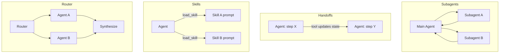

| Pattern | How it works | The analogy from class |
|---|---|---|
| **Subagents** | A main agent coordinates subagents *as tools*. All routing passes through the main agent, which uses the results. Subagents are stateless by default, which gives context isolation. | A manager who gets a team member's research and writes the summary |
| **Handoffs** | Behavior changes dynamically based on **state**: tool calls update a state variable that triggers routing or reconfiguration, and each state talks to the user directly. | A consultancy: "take this request, it's yours". The main agent is out of the picture |
| **Skills** | Specialized prompts and knowledge loaded **on demand**. One agent stays in control, calling `load_skill(name)` to pull in context as needed. The lightest-weight pattern. | Claude's "skills" panel: well-written prompts |
| **Router** | A routing step classifies the input and directs it to one or more specialized agents, whose results are synthesized. | A receptionist directing you to the right desk |
| **Custom workflow** | A bespoke LangGraph flow mixing deterministic logic and agentic behavior; it can embed any other pattern as a node. | (Router is itself just one example of this) |

Two distinctions from the notebook line up with what was said in class. **Supervisor vs. router:** a supervisor (the Subagents pattern) is a full agent that keeps conversation state and decides across multiple turns, while a router is a single classification step with no ongoing state. And for handoffs, the notebook's one-line summary is *"state decides configuration, tools decide state."* LangChain offers two ways to build it: a **single agent with middleware** that swaps the prompt and tools per state (simpler, covers most cases), or **multiple agent subgraphs** that transfer with `Command(goto=..., graph=Command.PARENT)`.

Handoff was a term coined by OpenAI's agent SDK and also exists in AutoGen; LangChain implements it in a more roundabout, state-based way. Mayank was candid that he prefers AutoGen's direct "team" concept here, and that LangChain's approach is harder — more on that tomorrow. A router, he noted, can use a small **classifier model** instead of a full LLM: it doesn't generate tokens or give reasons, it just picks one option, which makes it quick and cheap. (The model's name is garbled in the recording; Mayank pointed to his own video and a planned crash course on it.)

The notebook also summarizes LangChain's own comparison of how the patterns cost, in model calls:

| Scenario | Subagents | Handoffs | Skills | Router |
|---|:-:|:-:|:-:|:-:|
| One-shot request | 4 calls | 3 calls | 3 calls | 3 calls |
| Repeat request (same type again) | 8 calls | 5 calls | 5 calls | 6 calls |
| Multi-domain (3 parallel topics) | 5 calls, ~9K tokens | 7+ calls, ~14K+ tokens | 3 calls, ~15K tokens | 5 calls, ~9K tokens |

The pattern behind those numbers: **subagents and routers are stateless**, so they repeat the full flow every request but suit parallel, large-context domains. **Handoffs and skills are stateful**, so once a step or skill is active, repeat requests skip re-routing and save a good share of calls. Its first takeaway echoes the course's own refrain: default to a single agent first, and reach for multi-agent only when tools, context, teams, or latency genuinely demand it.

---

## 🗺️ What's Next

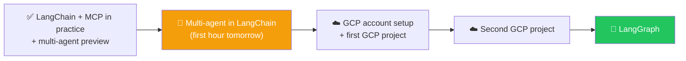

The project that's coming is the shared **Meridian AI** repo, which the class opened briefly. Per its README, it's a small web app that does two jobs: answer questions about uploaded documents (RAG on Google Cloud, with a React front end, a FastAPI backend, Gemini, and Vertex AI Vector Search), and review a purchase request with three AI specialists (risk, tax, and control agents) before a final "CFO" step writes a decision memo. It's deployed with Docker on Cloud Run. It will be taught next class; for now it's reading material.

Homework: read through the project's codebase, and the multi-agent notebook, before tomorrow. The future format is changing: for projects, learners get the code in advance and are expected to study it, so class time can go to the concepts and decisions rather than line-by-line typing.

---

## 🔑 Key Pointers to Remember

- **The adapter's job is translation.** It converts MCP results into LangChain content blocks and `ToolMessage` objects; without that, a LangChain agent can't understand the output.
- **MCP uses no tokens by itself.** Calling a tool directly is free of model cost; only the agent's reasoning around it spends tokens.
- **`content` is what the model sees; `artifact` is the exact structured output kept for your code**, under `artifact["structured_content"]`. Use that split (for example via middleware) to stop sending large structured payloads to the model.
- **Handle two failure types separately:** a tool that ran and reported an error becomes a status-error `ToolMessage` the agent can recover from; a transport or session failure raises an exception.
- **Tool annotations are metadata a server sends and a client can act on.** The destructive hint arrives as `tool.metadata["mcp"]["tool"]["annotations"]["destructive_hint"]` and can trigger human-in-the-loop for any such tool. This is not elicitation.
- **Start with the MCP config dictionary for several servers; switch to a client group** for mixed legacy/modern servers or per-server authentication.
- **Authenticate at the right level.** A shared company system can use a shared token; personal-account servers (Gmail, Outlook) need per-user authentication, never one stored token for everyone.
- **The new built-in `langchain.mcp` (`pip install "langchain[mcp]"`) is tools-only for now**, with no interceptor hook either. Fetch resources and prompts through the underlying FastMCP client, and check the docs, since it's in beta.
- **Handoff vs. sub-agent:** in a handoff the main agent steps out and the specialist answers the user; with a sub-agent the main agent stays in control and uses the result.
- **Depth wins interviews.** Interviewers probe past "I can connect it to MCP"; knowing the details is what separates you from candidates who only know the surface.

---

## 💬 Live Q&A Highlights

| Question | Answer |
|---|---|
| Why was the connection to the CineBot server failing at first? | The server file had been created by a notebook cell that also ran it, so no standalone file existed for the STDIO transport to launch. Point the transport at the real script. |
| Does the MCP server itself use tokens when it reads source data? | No. MCP tools can be called directly with no AI at all; only the LLM spends tokens when an agent is involved. |
| What's the difference between `invoke` and `ainvoke`? | The same work, done asynchronously — nothing else changes. |
| Does an end user see the agent's calls to the MCP server? | No — the routing happens internally; the user sees only the final reply. |
| Why does the elicitation demo fail with "unavailable on 2026-07-28 connections"? | Server-initiated elicitation is a legacy-era mechanism, so on a modern-protocol connection there's nothing to carry it. Legacy mode is needed, and the ecosystem is moving on from it. |
| How do I know whether a *third-party* MCP server added annotations to its tools? | Connect, list its tools, and print what comes back — servers send their tool metadata, and it's worth inspecting in a development environment. |
| Can a client learn how to authenticate (and what token type) from the server? | Effectively yes — servers state what they need: a key, a bearer token, or an OAuth browser redirect. Context7, for example, says how to create an API key. |
| How long does a bearer token last? | It depends on whoever issues it, like any API key; once it expires, calls fail again. |
| Can I implement OTP-based authentication through the agent or MCP itself (e.g. an agent on WhatsApp)? | Avoid it. Don't let an agent or LLM ask for a mobile number or OTP — it can alter or leak them. Use a browser redirect to a secure login page, as payments do, then return the token. |
| For a client group vs. an MCP config, which is used in production? | The config dictionary is the common one; client groups matter more now that legacy and modern servers coexist, or when servers need different auth. Try the config first. |
| Is a clarifying question from the agent the same as elicitation? | No. Elicitation is specifically a *server* asking mid-call; an agent asking for missing tool arguments is just the agent. |
| What is Context7 for? | It returns the latest documentation for a library (140K+ supported), so an agent's code doesn't rely on stale training data. It works without a key; a key only raises limits. |
| Why did the agent list 11 tools? | CineBot has 1 tool, TimeTrack 4, and Context7's two tools had each been appended three times because the cell was run three times (1 + 2×3 + 4 = 11). A set would dedupe them. |
| What's handoff, and how can I check the specialist's answer? | The main agent hands the request over and steps out; its reply goes straight to the user, so you don't verify it in the flow. You can still observe outputs and evaluate them as part of the overall agentic system, and an evaluator works as usual. |
| Can a router use a classifier instead of an LLM? | Yes — a small classification model just picks the destination, without generating tokens or reasoning, so it's quick and cheap. |
| Mermaid diagrams don't render in GitHub or VS Code — what should I do? | Update VS Code and the notebook/kernel extensions, install a Mermaid extension, or open the notebook in JupyterLab (drag and drop the file). |
| How do I deploy an MCP server for many users in a company (Docker/cloud)? | Docker is just a server: run the MCP over HTTP rather than STDIO, expose it, and deploy the container to AWS, GCP, or anywhere. |
| Should I focus on LangChain or LangGraph? | Both. LangChain is built on LangGraph, so start with LangChain, and use LangGraph for more transparency and control; both do the same job. |
| An enterprise (about 2,000 sales/finance users) needs a dashboard pulling from several systems — use Claude with MCP or a separate application? | For that scale, a separate application is better than expecting 2,000 people to build their own flows in Claude; it can use MCP servers in the backend. |
| Some SaaS MCP servers are paid. Should I build my own MCP over their APIs? | If the APIs are genuinely free to use, building your own server on top is possible; but if the vendor charges for the MCP server, expect their API access to be costly too. |
| Do I need to master every previous MCP version? | No — real adoption of the modern spec will take time; the aim is a deep understanding of one framework so the next one is easy. |
| Is the course enough to work on Agentic AI, and when does it end? | The plan is to cover LangChain and MCP in depth first, then frameworks and projects; expected to wrap up around January–February. |
| I'm a data/Databricks engineer — how should I approach this? | Keep your big-data skills intact and layer the AI concepts (how agents work) on top; the concepts are the same across tools. A Databricks-specific project is out of scope for the general audience. |
| Is a Python crash course available? | A 12-hour Python video (no AI, taught with the Python Tutor visualizer) was going live on Mayank's YouTube that night. |

---

## ✅ Action Items After Class 24

- [ ] 📥 `git pull` the Weekend 14 folder and `uv sync` in VS Code; confirm `import langchain.mcp` works (with its beta warning). The extra is installed with `langchain[mcp]>=1.4.0`
- [ ] 🌉 Connect a LangChain agent to the CineBot STDIO server, list its tools, call one directly, then through an agent, and compare token use
- [ ] 🔄 Call `get_seat_map` with a hand-built tool-call dictionary and print both `message.content` and `message.artifact["structured_content"]`
- [ ] ⚠️ Reproduce both failure types: a tool that returns an error (status-error tool message) and a server that fails to start (exception)
- [ ] 🏷️ Print a tool's metadata, find `destructive_hint` (snake case), and wire human-in-the-loop only to destructive tools
- [ ] 🧭 Connect two servers with a config dictionary, then with a client group in legacy mode, and note the differences
- [ ] 📚 Add Context7 to an agent without a key, then try a free key and compare limits
- [ ] 🧹 Dedupe a tool list with a `set`
- [ ] 📖 **Read the project code and the multi-agent notebook before tomorrow**, and create a GCP free-trial account

---

*📝 Notes compiled from the full Class 24 transcript and the class's own Weekend 14 code (the `MCP in Langchain` and `Multi Agents in Langchain` folders, with their executed notebook outputs) — "LangChain + MCP in Practice," Agentic AI 3.0 Specialization, Krish Naik Academy.*
